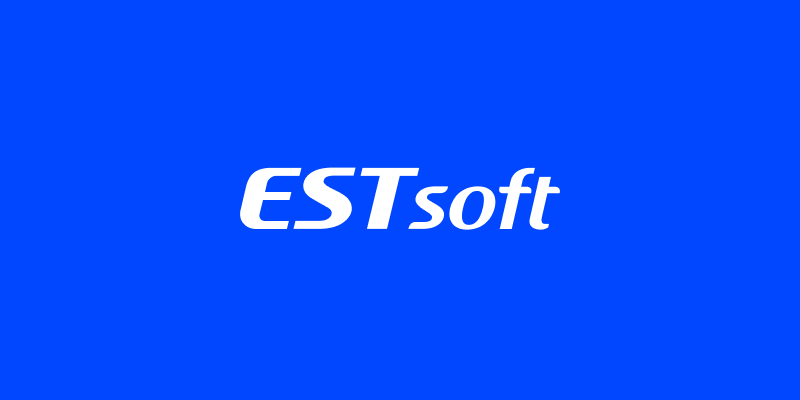
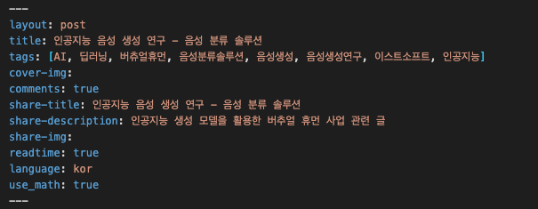

  

# ESTsoft Tech Blog

ESTsoft Tech Blog 입니다.

## Quicklinks
* [Getting Started](#getting-started)
    * [Issues](#issues)
    * [Contents](#contents)
    * [Pull Requests](#pull-requests)
* [Structure](#structure)
* [Markdown form Description](#markdown-form-description)
* [A License](#a-License)

## Getting Started

### Issues 생성하기
1. Repository의 Issues 탭 클릭
2. New issue 클릭
3. Title 및 Description 작성

### Contents 글쓰기
1. git clone
2. 새로운 브랜치 만들기 ( docs/컨텐츠 명 )
3. terminal 창 open
4. sh make-template.sh 명령어 입력
5. 문서명 입력
6. _posts 폴더 내 만들어진 파일 확인
7. 공통 form 예시대로 md 파일 작성
8. if 이미지를 삽입하고 싶은 경우 img/[해당년도]/[해당일자] 폴더 안으로 옮겨 참조하기

### Pull Requests 신청하기
1. git add
2. git commit -m 'docs: 새로운 컨텐츠'
3. git push
4. 관리자에게 pr 요청 (해당 브랜치 -> master 브랜치)
5. 작성된 내용 확인
6. 관리자 approve 시 테크 블로그 홈페이지 반영

## Structure
❗️필요한 폴더&파일 위주로 설명드립니다.
❗️안쓰는 파일은 ❌ 로 표시

1. _data 
    - ui-text.yml: 다국어 사용 설정 파일 ❌
2. _includes: 공통적으로 사용되는 section 파일 저장소
3. _layouts: 폴더명대로 여러 레이아웃 파일 저장소 
4. _posts: Markdown으로 작성된 블로그 컨텐츠들 저장소
5. _site: html로 build가 된 후 실제 웹페이지에서 보여지는 모든 파일 저장소
6. assets
    - css: css 파일들 저장소
    - image: image 파일 저장소
    - js: javascript 파일 저장소
7. docs: 현재 사용되지 않습니다. ❌
8. _config.yml: jekyll 설정 파일 
9. make-template.sh: 공통적으로 쓸 Form 파일 만들어주는 sh 스크립트 파일

## Markdown form Description

 

| 
이름
 | 
설명
 | 
초기값
 | 
비고
 |
| ---------------------- | ---------------------- | ---------------------- |  ---------------------- |
| layout | 레이아웃 | post | |
| title | 제목 |  | |
| tags | 태그들 |  | ex) [ ai, 이스트소프트, 프론트엔드 ] |
| cover-img | 대표 이미지 |  | |
| comments | 댓글 사용 유무 | true | |
| share-title | 제목 |  | meta 태그 (SEO 관련) |  
| share-description | 설명 |  | meta 태그 (SEO 관련)|
| share-img | 대표 이미지 |  | meta 태그 (SEO 관련)|
| readtime | 읽는데 걸리는 시간 | true | |
| language | 언어 | kor | |
| use_math | 수학 표기법 표시 가능 여부 | true | Mathjax 수식 |

## A License
